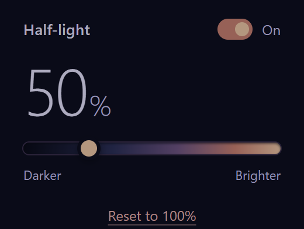
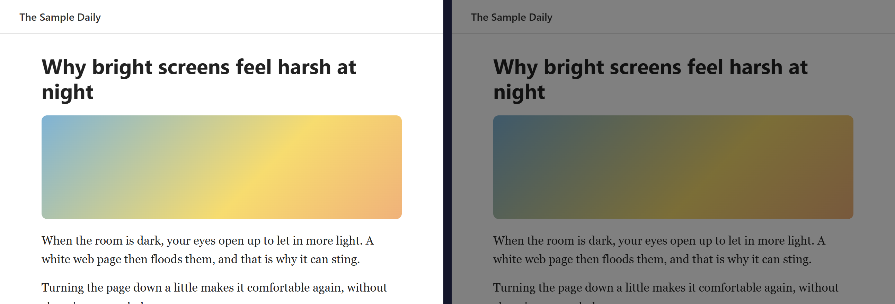

# Half-light: Page Brightness

A small Chrome extension that makes web pages darker or brighter with one slider. Made for tired eyes, especially at night.

## Install
Half-light isn't in the Chrome Web Store. You install it by hand, which takes about a minute:

1. **Download** `half-light-page-brightness-v1.0.0.zip` from the [latest release](https://github.com/Akzh00/half-light-page-brightness/releases/latest) (under **Assets**). The numbers are the version; a newer release has higher numbers.
2. **Unzip it:** right-click the zip → **Extract All** → **Extract** (on a Mac, double-click it). You now have a folder called `half-light-page-brightness-v1.0.0`.
3. **Move that folder somewhere permanent**, for example your Documents folder. Chrome runs the extension from it, so if you delete it later, the extension stops working.
4. Open `chrome://extensions` in Chrome and turn on **Developer mode** (switch at the top right).
5. Click **Load unpacked**, open the `half-light-page-brightness-v1.0.0` folder and click **Select Folder**. You'll only see an `icons` folder inside; that's normal, don't open it.
6. Half-light's icon appears in the toolbar. If you don't see it, click the puzzle-piece icon and pin **Half-light**.

Tabs that were already open need a refresh before they dim.

## Controls
- **Slider:** left = darker, right = brighter (20%–150%). Applies to every web page and is remembered.
- **On switch:** turns dimming off without losing your setting.
- **Reset to 100%:** back to normal brightness.
- **Alt+Down / Alt+Up:** darker / brighter without opening the popup. If dimming is switched off, a shortcut turns it back on. Change the keys at `chrome://extensions/shortcuts`. If the keys are blank there, another extension already uses them; pick your own.

## Good to know
- Chrome doesn't let extensions change its own pages (settings, new tab, Chrome Web Store), so those stay at normal brightness. The desktop and other apps aren't affected either.
- Above 100%, pages that are already light wash out to white. "Brighter" is most useful on dim or dark pages.
- **Privacy:** the extension collects no data. Your brightness setting is stored only in your own browser. Chrome lists it as able to "read and change data on all websites" because it has to change the brightness of every page.

## Update or remove
- **Update:** Half-light doesn't update itself. When a new version is out, download its zip, remove the old Half-light at `chrome://extensions`, and load the new folder the same way as above.
- **Remove:** open `chrome://extensions` and click **Remove** under Half-light. You can then delete its folder.

## Version
1.0.0. Made by Akzh00. No third-party art, fonts or sounds.
